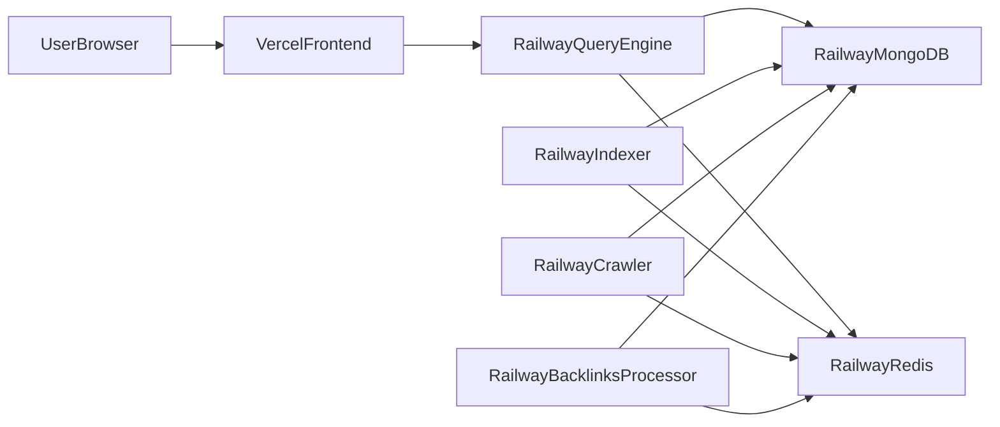

# Vercel + Railway Deployment Plan

## Goal
Deploy this monorepo with:
- Frontend on Vercel from [`/home/lucifer/projects/DBMSCP/frontend`](/home/lucifer/projects/DBMSCP/frontend)
- All backend Go services on Railway from:
  - [`/home/lucifer/projects/DBMSCP/src/query_engine`](/home/lucifer/projects/DBMSCP/src/query_engine)
  - [`/home/lucifer/projects/DBMSCP/src/indexer`](/home/lucifer/projects/DBMSCP/src/indexer)
  - [`/home/lucifer/projects/DBMSCP/src/crawler`](/home/lucifer/projects/DBMSCP/src/crawler)
  - [`/home/lucifer/projects/DBMSCP/src/backlinks-processor`](/home/lucifer/projects/DBMSCP/src/backlinks-processor)
- Data layer on Railway-managed MongoDB + Redis

## Deployment Topology

## Phase 1: Preconditions and Access
- Confirm/establish CLI auth for both platforms:
  - `vercel login`
  - `railway login`
- Verify local build/start commands used for deploy config:
  - Frontend scripts from [`/home/lucifer/projects/DBMSCP/frontend/package.json`](/home/lucifer/projects/DBMSCP/frontend/package.json)
  - Backend entrypoints from each `main.go` in the four services above

## Phase 2: Railway Project Setup (Backend)
- Create one Railway project for backend stack.
- Add managed MongoDB + Redis in Railway project.
- Create 4 Railway services mapped to monorepo roots:
  - `src/query_engine`
  - `src/indexer`
  - `src/crawler`
  - `src/backlinks-processor`
- For each service, configure:
  - Start command as `go run .` (or explicit equivalent if required)
  - `PORT` for HTTP service (`query_engine`); worker services keep default where applicable
  - Shared env vars injected from Railway Mongo/Redis service connection values:
    - `MONGO_HOST`, `MONGO_PORT`, `MONGO_USERNAME`, `MONGO_PASSWORD`, `MONGO_DB`
    - `REDIS_HOST`, `REDIS_PORT`, `REDIS_PASSWORD`, `REDIS_DB`
  - Crawler-specific env var:
    - `STARTING_URL`

## Phase 3: Backend Verification
- Confirm each Railway service reaches healthy state.
- Hit `query_engine` public URL health/basic endpoint and validate response.
- Check logs for Mongo/Redis connection success in each service.
- Validate no crash-looping workers.

## Phase 4: Vercel Setup (Frontend)
- Create Vercel project from same repo with root directory set to [`/home/lucifer/projects/DBMSCP/frontend`](/home/lucifer/projects/DBMSCP/frontend).
- Configure build/output:
  - Build command: `npm run build`
  - Output directory: `dist`
- Set frontend env var(s) for backend base URL (pointing to Railway query_engine public URL).
- Deploy and verify preview/production URL loads and calls backend successfully.

## Phase 5: Cross-Service Validation
- End-to-end test: UI search flow from Vercel frontend to Railway query_engine.
- Validate DB/cache-dependent behavior and error handling.
- Confirm CORS and API origin configuration are correct between Vercel domain and Railway API domain.

## Phase 6: Documentation and Handoff
- Final architecture
- Exact platform settings used
- Environment variable matrix
- Deploy/redeploy commands
- Rollback checklist
- Share live progress updates at each checkpoint (auth done, infra provisioned, services live, frontend live, e2e verified).

## Progress Update Cadence ("keep me in the loop")
During execution, provide short updates after each checkpoint:
- Checkpoint 1: platform auth complete
- Checkpoint 2: Railway data services provisioned
- Checkpoint 3: each backend service deployed
- Checkpoint 4: Vercel frontend deployed
- Checkpoint 5: end-to-end verification complete
